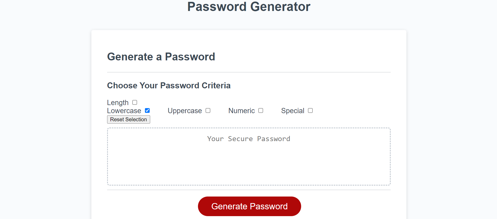
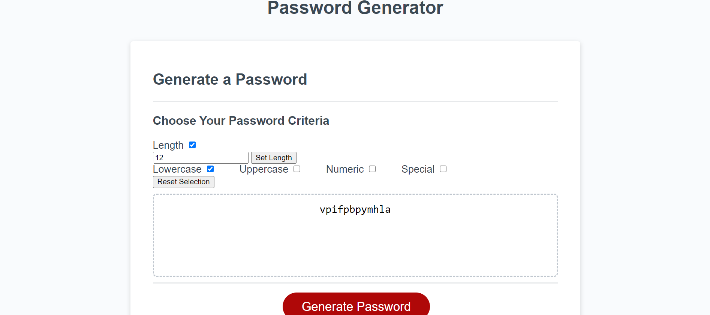
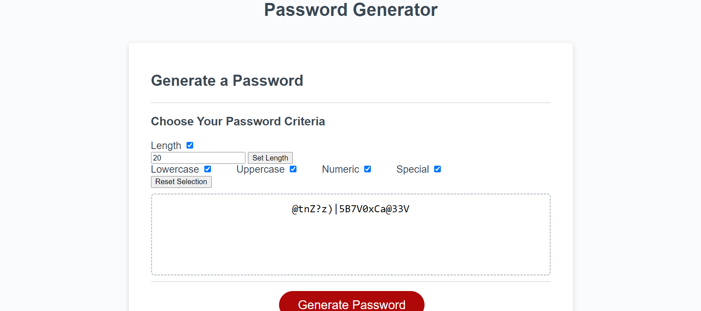

# Password-Generator

## Description

This website can be used to generate random passwords based on a set of user-selected criteria.

The user may decide to generate a password between the lenght of 8 to 128 characters inclusive; 8 is the default length if the length is not specified.

Users may also choose between generating a password with lowercase letters, uppercase letter, numbers, special characters, or any combination of the aforementioned character types. The default character type is lowercase.

## Usage

Generate a password simply by pressing the red button at the bottom of the page.

Enter the desired length and make sure to press the "Set Length" button to save the inputted length.

Any combination of character types can be selected to generate a password.

## URL
